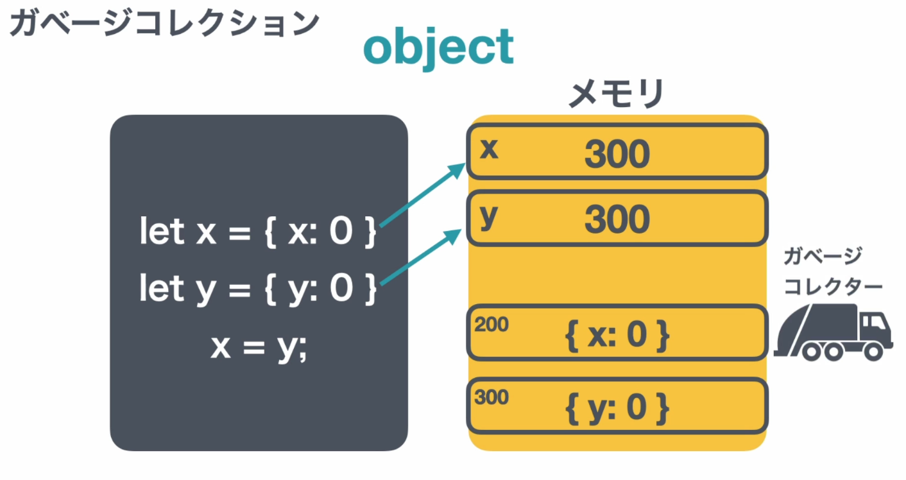

### 内蔵されているグローバルオブジェクト
```js
console.log();
```
これはconsoleオブジェクトのlogメソッドを実行している。
```js
parseInt('30');
```
なども、自分で定義していない関数やメソッドを支えている。

グローバルオブジェクト：グローバルで使える関数やメソッドを一覧で管理している。

```js
console.log(globalThis);
```
をすると一覧を確認できる。
```js
globalthis.console.log();
```
みたいに使える。
```js
globalThis.apple = 'apple'
```
と定義しておくと、`apple`というグローバル変数として使うことができる。
`alert()`は、ブラウザが追加したメソッドであり、ECMAスクリプトの仕様書に定義はない。

- ECMAスクリプトに定義されてる標準のオブジェクトは以下で確認できる。
https://developer.mozilla.org/ja/docs/Web/JavaScript/Reference/Global_Objects
- ブラウザで定義されているオブジェクトは以下で確認できる。
https://developer.mozilla.org/ja/docs/Web/API

ブラウザでは、`window`や`self`、`frames`でもグローバルオブジェクトにアクセスできる。
グローバルオブジェクトは上書きできる。

### var
`let`や`const`は2015に登場した。
それ以前は`var`
`var`はもう使う必要はない。
`var`は変数を定義するもの。定数を定義するものはなかった。

`let`と`var`の違いは？
- `let`は再宣言出来ないが`var`はできる
- `let`はブロック文の中で定義した場合ブロックの外からアクセス出来ないが、`var`ならできる。`var`であっても、関数の中で定義されると関数の中でしかアクセスできない。
- `var`で変数を定義すると、グローバルオブジェクトに変数が追加される。
- `var`は巻き上げられる。しかし初期値は巻き上げられない。
    ```js
    console.log(apple);
    var apple = 'apple';
    console.log(apple);
    // undefined
    // apple

    console.log(apple);
    let apple = 'apple';
    // エラー（Cannot access 'apple' before initialization）
    ```

### 関数宣言文とvarはここが似ている
- 関数宣言文も同じ名前で2回宣言できる。
- ブロック文の中で関数宣言文を定義しても、ブロック外からアクセスできる。
- 関数宣言文も、グローバルオブジェクトの一部になる。
- 関数宣言文も巻き上げられる。ただ、初期値も一緒に巻き上げられる。

なぜfunctionはletのような考え方にならないのか？
-> 後方互換性を持つため。（過去のコードを動かせるようにする）

### use strict
後方互換性を保ちつつ、言語の不備を補う。
`'use strict';`
これをすると、関数宣言文はブロック文の中で定義すると、ブロック外からアクセスできなくなる。
２行目以降に`'use strict';`すると、有効じゃない。（それ以前がコメントの場合は有効）
`<script>`タグごとに書く必要がある。
関数の１行目に`'use strict';`すると、その関数にのみ適用できる。

### primitiveとobject

primitive 
-> number, string, boolean, undefind, nullなど
object
-> オブジェクト, 配列, 関数

- どちらもメモリに保存される。
  - ディスクは、電源を切っても保存されているもの
  - メモリは、電源を切ったら消えてしまうもの

- primitive 
  - let x = 8とすると、xの場所に8を入れる。
  - 直接アドレス指定方式みたいな感じ
  - let y = 10として、yの場所に10が入った後、x=yとすると、xの場所に10が入る。

- object
  - let x = {x:0}とすると、200という場所に{x:0}が置かれて、xという場所に200というアドレスが置かれる。
  - 間接アドレス指定方式みたいな感じ
  - let y = {y:0}も同じように定義したあと（300という場所に{y:0}、yという場所に300）、x=yをした時、200が{y:0}に置き換わるのではなく、xに置くアドレスが300に置き換わる。
  - オブジェクト本体は変わらない。データが大きくなる可能性が高いから、いちいち動かすのは大変なので、アドレスを動かしている。
  - reference型とも言われる

```js
const coffee = {
    name: 'Caffe Latte',
};
const coffee2 = coffee;  // coffeeはアドレスであり、coffee2にcoffeeのドレスが入る。
coffee2.name = 'black'; // coffee2のnameを書き換えても、coffeeと同じものを編集してしまう
console.log(coffee.name); // black
```

```js
const coffee = {
    name: 'Caffe Latte',
};

const coffee3 = {
    name: 'Caffe Latte',
};
// coffee3にcoffeeと全く同じオブジェクトを入れても、
// coffee3には別のアドレスが代入される

console.log(coffee === coffee3);
// false
```

constは再代入できないだけで、オブジェクトの場合、アドレスは変えられないが本体は変更できる。
```js
const coffee = {
    name: 'Caffe Latte',
};

const coffee = {
    name: 'aaa',
};
console.log(coffee.name);
// エラー

coffee.name = 'aaa';
console.log(coffee.name);
// aaa
```

### ガベージコレクション
  

上図のように、x=yとしてxに300というアドレスが入った時、200にある{x:0}にはアクセスできなくなる。このような不要なメモリのデータを削除するのがガベージコレクションである。